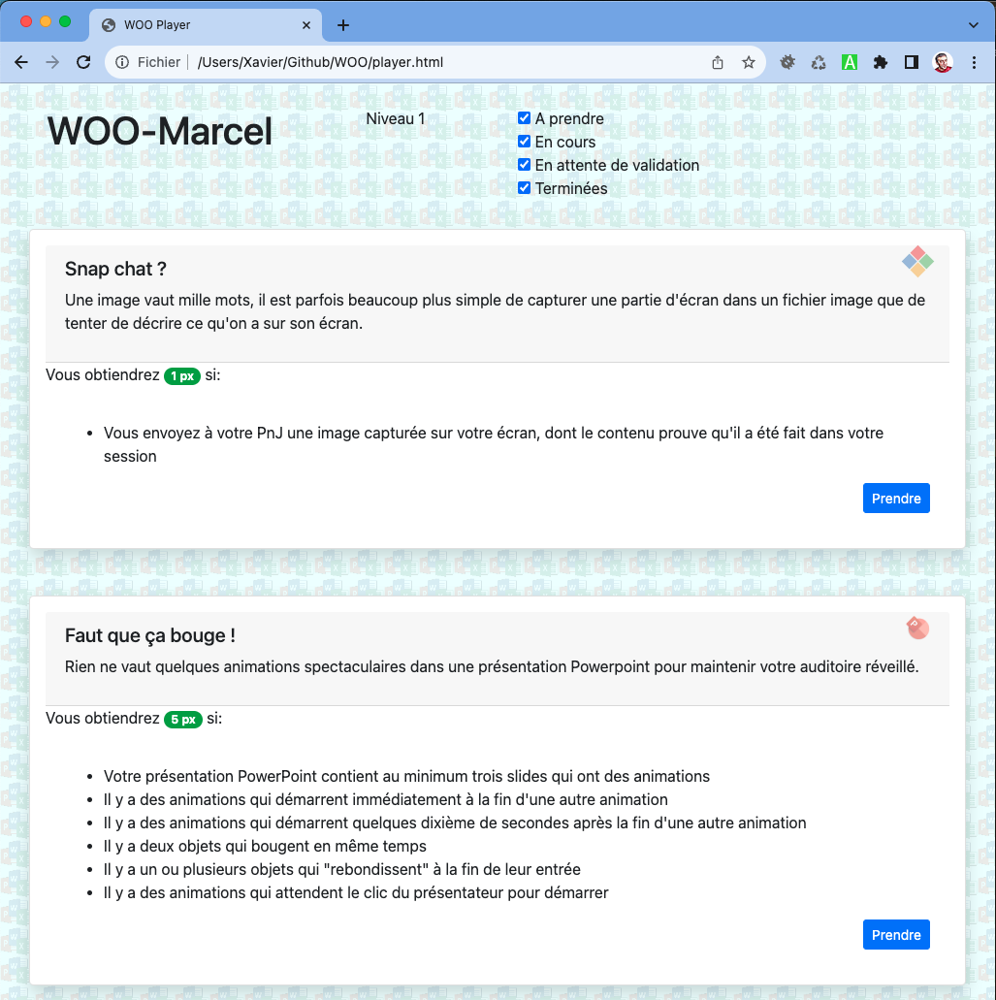

# Configuration d'un joueur WOO

- Téléchargez le ZIP de ce repo
- Extrayez le dossier `WOO-main` de ce zip et placez-le dans vos dossiers de travail sous le nom de `WOO` 
- Connectez-vous à etml.icescrum.com (créez un compte si nécessaire)
- Importez le projet WOO-Player qui se trouve dans le dossier `WOO`. Lors de l'importation, vous aurez un message de conflit de clé de projet. Changez la clé `WOOXXXXXXX` en `WOOIIIYYYY`, où `III` sont vos initiales (p.ex: `GBY` pour Gérard Bellamy) et `YYYY` est l'année en cours. Exemple: `WOOGBY2024`. Notez cette clé, vous allez en avoir besoin plus loin.
- Dans les settings du projet (shift-S), changez le nom du projet `WOO-Player` en `WOO-Gérard`
- Dans Settings > Team and project members
  - Assurez-vous avec votre PnJ que vous avez bien été intégré dans l'équipe WOO 
  - Assurez-vous votre PnJ fait partie des Product Owners
- Dans les détails de votre compte IceScrum (cliquez sur l'avatar, puis MyAccount > Account), sélectionnez l'onglet `API tokens`. Créez un token nommé 'WOO', copiez-le dans le presse-papier
- Quittez IceScrum et ouvrez le dossier WOO
- Ouvrez le fichier `Player Config.html`. Remplissez le formulaire:
  - Collez le token que vous venez de mettre dans le presse-papier
  - Saisissez la clé de projet (`WOOGBY2024`)
- Téléchargez le fichier de configuration, déplacez-le dans votre dossier WOO

Votre configuration est achevée si vous obtenez quelque chose comme ceci en ouvrant le fichier `Player.html`

